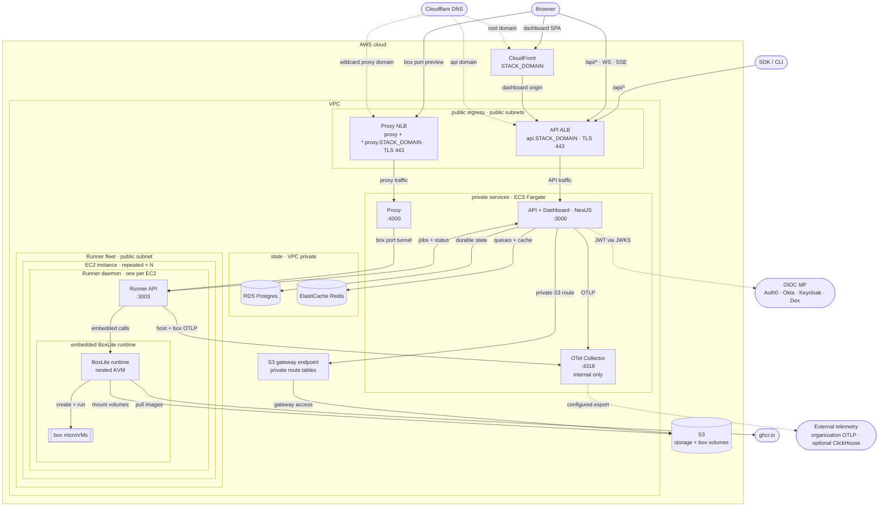

# BoxLite cloud applications

The applications under this directory form BoxLite's hosted control plane and
runner data plane. This view shows how public traffic reaches private services,
how the control plane schedules boxes, and where state and telemetry flow.

## Architecture

### Current

The deployment runbook and operational constraints live in
[`infra/docs/deployment.md`](./infra/docs/deployment.md).

### Tunnel capacity

| Environment variable | Default | Scope |
| --- | --- | --- |
| `PROXY_MAX_TUNNELS` | 256 | Concurrent public CONNECT requests per Proxy process |
| `RUNNER_MAX_TUNNELS` | 256 | Concurrent guest tunnels per Runner process, across all Proxies |
| `RUNNER_MAX_TUNNELS_PER_BOX` | 32 | Concurrent guest tunnels per Box on that Runner |

Limits must be positive; the per-Box limit cannot exceed the Runner total.
Admission is immediate: excess requests receive HTTP 503 without waiting for a
slot. Runner refusals remain 503 through both CONNECT and HTTP preview. Runner
slots cover setup through complete stream shutdown, including TCP half-close;
Box names and IDs share the same quota. Ordinary HTTP preview connections count
toward the Runner limits, but not the public CONNECT limit on the Proxy.
These limits do not cap all accepted sockets or impose an idle timeout. Tune the
initial defaults to the deployment's measured capacity.

## API catalog

See [`API.md`](./API.md) for the categorized inventory of every application
interface, including its method, path, owning service, and purpose. Alongside
the registered routes it covers outbound events, static asset trees, the local
development stack, and the APIs whose clients live here but whose routes are
served elsewhere.

## Data model

See [`SCHEMA.md`](./SCHEMA.md) for the control-plane Postgres schema: every
table with its columns, keys, and indexes, how the tables relate and which of
those relationships the database enforces, and the satellite stores that sit
beside it.
