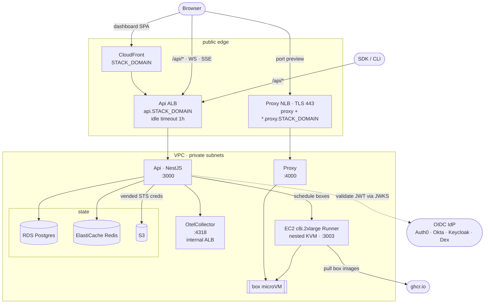

# BoxLite Infra (SST on AWS)

Deploys the BoxLite control plane: ECS Fargate services, an EC2 Runner with
nested KVM, RDS Postgres, ElastiCache Redis, S3, and CloudFront.

- **Region** — `AWS_REGION`, default `ap-southeast-1`
- **IaC** — SST v4 (Pulumi underneath)
- **Cost** — ~$470/month always-on; see [Cost](#cost)

**Where the "why" lives:** design rationale sits in comments next to the code it
explains, mostly under `stack/` and `deployment/`. This file is the runbook.

## Architecture



## Prerequisites

`npm run login` and `npm run bootstrap` set up everything except the accounts
and the stack itself:

| You provide | Notes |
| --- | --- |
| An AWS account | `npm run login` runs `aws login` — no IAM user, no access keys |
| A GitHub repo | `npm run login` runs `gh auth login` |
| A Cloudflare domain + API token | One manual step — see [Cloudflare API token](#cloudflare-api-token) |
| An OIDC tenant | Signup is always manual. `--provision-auth0` creates the SPA app and API **only on Auth0**, then prints the login-policy preview command; any other compliant IdP needs equivalent configuration by hand |
| An existing stack that already has its first Runner | First-Runner provisioning is not implemented here; a *further* one is [scaling out](#scaling-runners-out) |

## Deploy an existing stack

This updates an existing stack. It never replaces a Runner, and it creates one
only when the dispatch explicitly names it — see [scaling out](#scaling-runners-out).

```bash
cd apps/infra
npm install
cp .env.example .env && $EDITOR .env   # STACK_DOMAIN, OIDC_ISSUER_BASE_URL, OIDC_AUDIENCE

npm run login                          # browser sign-in: AWS, GitHub, Auth0
npm run bootstrap -- --stage dev       # IAM role, GitHub Environment, secrets

# Optional, and NOT idempotent — this creates the Auth0 SPA and API identities:
npm run bootstrap -- --stage dev --provision-auth0

gh workflow run deploy-infra.yml --ref main -f stage=dev -f apply=false  # preview
gh workflow run deploy-infra.yml --ref main -f stage=dev -f apply=true   # deploy

# After the dashboard deploy publishes /auth0/*, preview and apply Free-plan branding:
npm run auth0:universal-login -- preview --stage dev
npm run auth0:universal-login -- apply --stage dev
```

For local SST commands, the deploy wrapper detects the AWS CLI `login_session` created by
`aws login` and exports its temporary process credentials only to SST/Pulumi. Nothing is written to
a credentials file or printed. Static/shared-config profiles and CI's OIDC environment credentials
keep using their existing credential paths.

`npm run bootstrap` is safe to re-run. It prompts once per stage for the
Cloudflare token and `OIDC_CLIENT_ID`, and loads your `.env` into the stage's SST
secret store alongside `OIDC_CLIENT_ID`. The Cloudflare pair goes to SSM and to
the stage's GitHub Environment instead, because reading the store initializes the
Cloudflare provider. On that Environment it also sets the `AWS_ACCOUNT_ID` and
`AWS_REGION` variables, which the deploy workflow needs before it has any AWS
credentials. `--force` re-prompts for an already-seeded Cloudflare credential. Its
full flag list is in the script's header comment.

Universal Login assets ship in the dashboard/API deployment under `/auth0/`.
Their exact sources, content-hashed filenames, license, headers, and update
procedure are recorded in
[`auth0/branding/ASSETS.md`](../auth0/branding/ASSETS.md). Deploy the dashboard
first. The dedicated command resolves URLs from its reviewed stage target and
fails before its first Auth0 write unless the live stack identity matches and
every asset is reachable, has the expected media type, and permits the public
Universal Login origin.
It applies the Auth0 theme and custom prompt text only. Widget geometry remains
Auth0-managed because custom Universal Login page templates require a paid plan.

A deploy takes 10–15 minutes and prints the service URLs. On a transient
registry error, just rerun — SST resumes from the failed step.

## Auth0 email-first login policy

Run this only for a dedicated BoxLite Auth0 tenant. Identifier First is a
tenant-wide setting. The selected database connection gets this behavior:

```text
new account       email -> 6-digit email OTP -> create password -> token
returning account email -> password -> token
password reset    email -> email OTP -> create password
```

Existing unverified database users receive a hosted Auth0 verification Form on
their next browser login. Social and enterprise connections, other Auth0
applications, and non-`auth0` subjects are outside this policy.

First configure an external Auth0 email provider and enable the
`verify_email_by_code` and `reset_email_by_code` templates. Auth0's built-in
provider is testing-only. The stack's own SES identity serves this: run
`npm run bootstrap -- --stage <stage> --provision-ses` (see [Outbound mail](#outbound-mail)) and
give Auth0's SMTP provider `email-smtp.<region>.amazonaws.com:465` with the
`SMTP_USER` / `SMTP_PASSWORD` it stores. Then run the reconciler from this directory; preview
is the default and performs no writes:

```bash
# Request the Management API scopes used by preview, apply, and rollback.
npm run auth0:login-policy-login

npm run auth0:configure-login -- \
  --tenant <tenant.auth0.com> \
  --client-id <boxlite-spa-client-id> \
  --connection boxlite-users

# Inspect the exact tenant/client/connection/resource plan, then apply it:
npm run auth0:configure-login -- \
  --tenant <tenant.auth0.com> \
  --client-id <boxlite-spa-client-id> \
  --connection boxlite-users \
  --apply
```

For a non-production canary tenant only, add
`--allow-test-email-provider`. Apply writes a mode-`0600` rollback journal under
`.sst/auth0-backups/` without client secrets. If apply stops partway, use the
exact rollback command printed in the error. The reconciler preserves unrelated
connection options and post-login Actions; it unbinds the superseded
`boxlite-custom-claims` Action. Retain successful journals: their created-resource
receipts are the proof required to reuse the otherwise opaque Auth0 Vault connection.
If a same-named Form or Flow differs from the checked-in graph, apply fails before
writing instead of backing up arbitrary remote payloads.

Before deploying the BoxLite API JWT guard, run all five live canaries against
the Auth0 tenant:

1. New database signup: email OTP, then password creation.
2. Returning database login with password.
3. Password reset with email OTP.
4. Existing unverified database login: Form, invalid-code error, resend, then success.
5. Social login remains unchanged.

The deployment order is intentional: Auth0 apply -> live canaries -> BoxLite
API deploy. The API then rejects old unverified `auth0|...` access tokens across
HTTP, Socket.IO, and the WebSocket proxy. It does not revoke refresh tokens or
retroactively gate independently validating Commerce/Analytics services.

**Adding a stage:** run `npm run bootstrap -- --stage <name>`, then add `<name>`
to the `options` of whichever Environment-selecting inputs should reach it —
`stage` in `.github/workflows/deploy-infra.yml` and `deploy-release.yml`, and
both `stage` and `source_stage` in `build-apps-api-image.yml` (a stage absent from
`source_stage` can never be promoted *from*). Those lists are allowlists, so a
typo cannot target a protected Environment, and they are deliberately
independent: see [.github/workflows/README.md](../../.github/workflows/README.md)
for which path currently reaches which stage.

## Outbound mail

The stack verifies one Amazon SES domain identity (`MAIL_DOMAIN`, default
`mail.boxlite.ai`) and publishes its DKIM and DMARC records through the same
Cloudflare adapter the rest of the stack uses. The Api reaches SES over the SMTP
interface on port 465, so `SMTP_HOST`/`SMTP_PORT`/`SMTP_USER`/`SMTP_PASSWORD`
stay a vendor-neutral contract — only `stack/mail.ts` knows the backend is SES.
Two senders use that one identity: the Api's organization invitation, and Auth0's
verification and reset codes.

```text
bootstrap --stage <s> --provision-ses   IAM user boxlite-<s>-smtp, send-only on this identity
  └─ access key                → SMTP_USER + SMTP_PASSWORD (SigV4-derived) in the secret store
       └─ deploy               stack/mail.ts → SES identity + DKIM/DMARC → Api SMTP_* env
```

- **The credential is bootstrap's, not the deploy's.** The deploy role holds IAM
  on roles only, so it cannot create the user or its access key; `--provision-ses`
  does that with the operator's credentials. Rerunning rotates the key and revokes
  the previous one.
- **The sandbox exit rides along, once the domain is verified.** A new SES account
  sends 200 messages/day to verified recipients only, and `--provision-ses` asks
  AWS to lift that — but only when `sesv2 get-email-identity` reports the sender
  domain verified. On a first bootstrap it is not (the deploy creates the
  identity), so the request is deferred with a message saying to deploy and rerun.
  A request made with no identity behind it is the shape AWS denies, and there is
  only one submission to spend: it reads `sesv2 get-account` and does nothing once
  access is granted, nothing while a review is open, and reports the case id when a
  review has closed DENIED or FAILED rather than resubmitting — AWS answers a
  second submission with ConflictException, so a denial is worked through that
  support case. Account-and-region wide, so the first stage bootstrapped in a
  region covers the rest, and a failure here never fails the bootstrap.
- **No credential, no mail.** `SMTP_HOST` resolves to empty unless both
  `SMTP_USER` and `SMTP_PASSWORD` are set — nodemailer authenticates only with
  both, so half a credential would send unauthenticated and be refused on every
  message. The Api reports the empty host once at boot as email disabled;
  invitations are still created, just not delivered.
- **One stage per domain.** An SES identity is unique per account and region.
  A second stage needs its own subdomain, or adopts the existing identity with
  `sst.aws.Email.get`.
- Sending costs $0.10 per 1,000 messages, which is why it has no line in [Cost](#cost).

## Symmetric artifact deployment

Both deployable components use one source selector:

| Mode      | API                                                        | Runner                                                           |
| --------- | ---------------------------------------------------------- | ---------------------------------------------------------------- |
| `build`   | immutable `boxlite-app-<stage>-api:v<version>-<sha>` in ECR    | CI builds that commit and stages a private S3 tarball + checksum |
| `release` | immutable `boxlite-app-<stage>-api:<version>` in ECR           | GitHub Release tarball + checksum for the same `<version>`       |

Both modes hand SST an image reference, so no deploy compiles the API. The one
exception is a build with no API ref — set neither `BOXLITE_ARTIFACT_REF` nor
`API_ARTIFACT_REF` and nothing was published for that checkout, so SST builds
`apps/api/Dockerfile` as before. That is a plain local `npm run deploy`, and also
`npm run runner:build-artifact`, which stages a Runner and sets only the Runner's
ref. Whatever refs *are* set must equal the checkout: the Proxy and the
OtelCollector are built from it on every path, so a ref naming another commit
would deploy two.

`.github/workflows/deploy-infra.yml` is the normal path. It accepts the full SHA
of any commit already on `main` (current `main` by default), or the head of an
open pull request in this repository — never a fork's — and builds each
component in its own job — the Linux x64 C SDK and Runner on one leg, the API
image on the other, sharing only the ref resolution — then stages the
commit-keyed Runner object and deploys both. The Runner reports
`<workspace-version>+<sha>` so two commits with the same Cargo version are still
distinct upgrade targets; the API tag carries the same pair.

`.github/workflows/deploy-release.yml` is the release path. It sets one stable
`VERSION=X.Y.Z` for both components and compiles neither. The deploy wrapper
verifies the ECR image and Runner release assets before invoking SST.

`build-apps-api-image.yml` is where every API image is built. `deploy-infra.yml`
calls it for the commit being deployed (`v<version>-<sha>`, into that stage);
dispatching it with `operation=build` builds a released tag once into dev, and
`operation=promote` copies that exact manifest registry-side, addressed by
digest, rather than rebuilding. The dispatched operations run from `main`: a
release event runs on a tag ref, and the deployment Environments that hold the
AWS role are branch-scoped, so a tag-triggered job never reaches its
credentials.

Either path first runs deployment safety tests that require every Runner to
retain `protect: true` and the AMI/user-data ignore rules. The build path then
runs a full `sst diff` under the mandatory `policies/runner` policy pack, which
rejects replacing or deleting a Runner instance and any in-place Runner change
other than provider association or tags — the same pack the apply runs under, so
a plan it refuses can never be applied. Workflow dispatch
defaults to a preview-only run; set `apply=true` only after reviewing it. An
apply run repeats the same guarded preview before the full-stack deploy:

```bash
npm run deploy -- --stage dev
```

`--target` is rejected for deploys, always. Pulumi treats a targeted update as a
partial one that still depends on resources it omits, so it cannot safely migrate
a provider while those resources reference the old registration — deploying this
stack with `--target Api` stopped SST on `StorageBucket` before any application
resource reached AWS. Targeted `diff` remains available for read-only inspection.

`--exclude` is accepted for exactly two scopes, which drop the mutable half of one
deployable leg — its service or instance, and the binary-upgrade commands that go
with it — while keeping every shared and provider resource in the plan. The leg's
ref-independent scaffolding (`RunnerRole`, `RunnerProfile`, `RunnerSecurityGroup`,
`RunnerArtifactS3Policy`) still reconciles, as a no-op:

```bash
npm run deploy -- --stage dev                     # both legs
npm run deploy -- --stage dev --exclude Runner    # Api leg only
npm run deploy -- --stage dev --exclude Api       # Runner leg only
```

`deployment/scope.ts` is the allowlist, and `deployment/capabilities.json` tells the
preflight which artifacts to verify — an excluded leg is not deployed, so its
artifact is not required to exist. Any other selector is refused. `deploy-infra.yml`
exposes the same three scopes as its `components` input and skips the build jobs
for a leg it excludes.

A deploy needs a *deployed commit* whose tooling understands it, which is not the
same commit as the workflow: `workflow_dispatch` reads the workflow definition
from the dispatch ref while the deploy job checks out the selected one. So a
`ref`/`pr` dispatch can pair a new workflow with tooling that predates it. The
job reads that commit's `deployment/capabilities.json` right after checkout and
refuses before assuming the deploy role — every deploy needs `stageConfigStore`,
and a narrowed one additionally needs `componentSelection`. A commit that
declares neither cannot be deployed by this workflow at all; rebase it, or name a
newer `ref`.

A narrowed deploy leaves the excluded leg on whatever commit an earlier run put
there, so the stack is then mixed-commit; the residual partial-update risk above
is why `apply` defaults to false and the guarded preview runs first. Run the
first `--exclude Api` (`components=runner`) dispatch with `apply=false` and read
the plan: only `--exclude Runner` has been exercised against this stack, and that
scope is also the one that turns off the Api image preflight. The Runner
EC2 identity and binary remain stable through the controls under
[Operating rules](#operating-rules), and the matching artifact preflight always
runs before deployment.

The workflows are manual/serialized, restricted to `main`, and bound to protected
GitHub Environments. GitHub OIDC supplies short-lived AWS credentials; no AWS
access keys are stored in GitHub, and no stage configuration either — a job reads
that from the stage's SST secret store using the credentials it just assumed, so
nothing is written to disk and there is no `.env` for a failed job to leave behind.

`bootstrap/aws/github-deploy-role.yaml` bootstraps three things that must exist **before** an
SST deploy: the OIDC role, the immutable Api ECR repository, and the private
Runner artifact bucket. That bucket expires only superseded object versions —
first boot re-fetches the commit-keyed tarball at every instance launch, so
expiring the current object would make a later replacement fail to boot. The role
grants only the AWS control-plane actions
used by this SST stack. IAM mutation is limited to `boxlite-<stage>-*` roles, policies, and
instance profiles, so one stage cannot rewrite another's. Every role created by SST must carry the stage's runtime
permissions boundary, which excludes IAM mutation and limits workloads to the
data-plane APIs they need. Redeploy that CloudFormation stack whenever its policy
or resources change. `IAM_PERMISSIONS_BOUNDARY_STAGE` must match both the SST stage
and the template's `GitHubEnvironment`; deployment fails before creating roles if
they differ. Keep required reviewers enabled on each Environment.

## Secrets & credentials

Nothing secret lives in git. A stage's configuration and its application secrets
live in one place — its SST secret store, encrypted in the SST state bucket and
readable by exactly the people who can already deploy that stage. The Cloudflare
provider credentials are the one exception and are reachable two other ways, so
offboarding still means revoking GitHub as well as AWS. Secrets are per-stage; seed
each stage you run.

| What | Stored in | Set by |
| --- | --- | --- |
| App secrets (`OIDC_CLIENT_ID`, Auth0 Management API, Svix, PostHog, `USAGE_EXPORT_TOKEN`) | SST secret store | `npm run bootstrap`; others via `npm run sst -- secret set <NAME> --stage <stage>` reading stdin |
| SES SMTP credential (`SMTP_USER`, `SMTP_PASSWORD`) | SST secret store | `npm run bootstrap -- --stage <stage> --provision-ses`, which mints the send-only IAM user the deploy role cannot create and derives the SMTP password from its key. Rerunning rotates it |
| Cloudflare creds (`CLOUDFLARE_API_TOKEN`, `CLOUDFLARE_DEFAULT_ACCOUNT_ID`) | AWS SSM SecureString for local use; GitHub Environment secrets for CI (which win) | `npm run bootstrap` |
| Stage config (`STACK_DOMAIN`, `OIDC_*`, toggles) | SST secret store | `npm run bootstrap`, from your local `.env` |

Never pass secret values as command arguments or echo them. Rotate on any
suspected disclosure. `npm run secrets -- --stage dev` lists what is set.

`.env` is bootstrap's input, not a deploy's. Bootstrap loads it into the store, and
`deployment/sst.ts` reads it back into the environment before invoking sst, so a
local `npm run deploy` and a CI deploy resolve the same values from the same place.
Editing `.env` therefore changes nothing until you rerun bootstrap.

Two rules narrow what the store may put into a deploy's environment, because
`sst secret set` accepts any name from anyone who can deploy:

- only keys named by the `BOXLITE_STAGE_CONFIG` manifest bootstrap writes. That is
  also what makes a key you delete from `.env` stop applying: `sst secret load`
  merges, so the old value stays in the store and simply goes unread. Tidy it up
  with `npm run sst -- secret remove <NAME> --stage <stage>` when you care.
- never local credential context (`AWS_PROFILE`, `AWS_CLI_PATH`) or the artifact
  selectors CI owns — see `FORBIDDEN_DEPLOYMENT_KEYS` in
  `deployment/key-policy.ts`.

A variable already set in the environment always wins over the store. That is how
the deploy workflow keeps control of the selectors it sets, and how you override a
stored value for a single command.

The Cloudflare credentials cannot join the store, for two independent reasons.
Reading the store initializes every provider `sst.config.ts` declares, Cloudflare
included — `sst secret list` gets as far as the bootstrap state and then exits with
`Cloudflare API not initialized` — so a token kept there would be needed in order to
read itself. CI passes the two values as Environment secrets rather than reading the SSM copy.
Whether the deploy role could read it is untested: it holds `ssm:GetParameter` and no
identity-based `kms:Decrypt`, but `alias/aws/ssm` is an AWS-managed key whose key policy
may admit the account via `kms:ViaService`, and the role trusts only the GitHub OIDC
principal so it cannot be assumed locally to check. Measuring that from inside a job is
what would let the Environment secrets go away.

Otherwise two variables are configured on the GitHub side, per stage, and neither can live in the
store because `configure-aws-credentials` reads both before any AWS credentials exist:

- `AWS_ACCOUNT_ID`, from which the workflows compose
  `arn:aws:iam::<id>:role/boxlite-<stage>-github-deploy`. Required.
- `AWS_REGION`, needed only by a stage outside the workflows' default. Bootstrap writes it either
  way, since it knows the region it just deployed into.

Each stage's GitHub Environment must still exist under exactly the stage name — the trust policy pins
`repo:<owner>/<repo>:environment:<stage>` — and that is where required reviewers are enforced.

Run SST through the npm scripts, never bare `npx sst` — the wrapper loads the stage
configuration from the secret store, enforces the Runner safety policy, and scrubs
Pulumi event logs that can contain provider credentials. `sst dev` is disabled.

### Cloudflare API token

The one credential a browser login cannot provide: Cloudflare only issues a
first API token through the dashboard.

**[Create the token →](https://dash.cloudflare.com/?to=/:account/api-tokens&permissionGroupKeys=%5B%7B%22key%22%3A%22zone%22%2C%22type%22%3A%22read%22%7D%2C%7B%22key%22%3A%22dns%22%2C%22type%22%3A%22edit%22%7D%5D&name=BoxLite%20deploy)**

That link opens the **account** token form with `Zone:Read` + `DNS:Edit`
pre-selected. Pick the zone serving `STACK_DOMAIN`, confirm, and paste the value
when `npm run bootstrap` prompts. Account-owned tokens survive the creator
leaving the org; creating one needs Administrator or Super Administrator.

Cloudflare offers no machine-to-machine OAuth grant for third-party clients, so
this cannot be automated. Its `cf` CLI can mint a DNS-capable OAuth token, but
it expires in about an hour and its refresh tokens are single-use — unusable as
a stored CI secret. cert-manager, external-dns, and SST's own Cloudflare guide
all require the same manual token.

## Common commands

```bash
# Preview a specific commit instead of current main: one already on main, or the head of an open
# pull request in this repository (a fork's head is refused). Dispatch stays --ref main either way;
# the job conditions test the launch branch, not this input.
gh workflow run deploy-infra.yml --ref main -f stage=dev -f apply=false -f ref=<full-commit-sha>

gh workflow run build-apps-api-image.yml --ref main -f operation=build -f version=0.9.8
gh workflow run build-apps-api-image.yml --ref main -f operation=promote -f stage=prod -f version=0.9.8
gh workflow run deploy-release.yml --ref main -f stage=prod -f version=0.9.8
npm run runner:build-artifact -- --stage dev # local linux/amd64 build + private S3 stage

npm run sst -- diff --stage dev      # preview changes
npm run sst -- unlock --stage dev    # recover from "concurrent update detected"
npm run sst -- shell --stage dev     # shell with SST-linked env vars
npm run runner:update -- --stage dev # roll the Runner binary, one host at a time
```

Every deploy and removal requires an explicit `--stage` so the deployer, the
verifier, and destructive operations cannot target different stages.

`deploy`, `remove`, `sst`, and `secrets` all pass through the guarded deployment
facade — do not call the SST binary directly. `runner:update` rolls one host at a
time and stops on the first failure.

## Operating rules

**The Runner holds state.** `/var/lib/boxlite` and the live microVMs are on its
root disk, so `stack/runners.ts` marks it `protect: true` with
`ignoreChanges: ['ami', 'userDataBase64']`. Routine deploys never replace it.
The CI gate rejects any Runner delete, replace, or protected-property change — so
scaling down remains a separate operation this repository does not implement,
while scaling out is an ordinary deploy.

### Scaling Runners out

`RUNNERS` in the stage's secret store says how many Runners the stack declares.
Raising it is the whole decision; the next deploy creates the host:

```bash
cd apps/infra
npm run sst -- secret set RUNNERS 2 --stage dev     # declare it

gh workflow run deploy-infra.yml --ref main \
  -f stage=dev -f components=api+runner -f apply=false   # preview the create
gh workflow run deploy-infra.yml --ref main \
  -f stage=dev -f components=api+runner -f apply=true    # create it
```

The policy pack guards the hosts that already exist, not the count. A Runner the
inventory declares and the state does not hold yet is a create, and a create has
no state to be compared against — so the two fingerprint checks are skipped for
it. Nothing else is: the new host still has to be `protect: true`, ignore exactly
`ami` and `userDataBase64`, and carry the identity tags its inventory entry
specifies. A Runner the state holds but the inventory has stopped declaring is
still refused, because Pulumi reads an undeclared protected resource as a delete.

Keep the Runner in `components`. `--exclude Runner` leaves the new instance out of
the plan, so the run reports success having created nothing and the host appears
on whichever later deploy does include it.

The API seeds only the default Runner. Extra ones are registered with the control
plane after the deploy by `RegisterExtraRunners`, each with its own token.

**Version bumps reach the fleet by rolling upgrade, not replacement.** A deploy
runs `scripts/runner-update-binary.mjs` per host over SSM, chained so hosts
upgrade one at a time. Each host verifies the selected artifact's checksum before
stopping its service, and restores its backup if the new binary fails to report
healthy.

**Runners cache image refs exactly.** `BOXLITE_SYSTEM_IMAGES` (comma-separated
`name=ref`) adds box images without a code deploy, but publish updated bytes
under a new tag or digest — repushing a mutable tag leaves already-cached
Runners serving the old image.

**A Runner's version is its artifact's identity.** On the release path it is
`Cargo.toml`'s `version` at the repo root; on the build path it is that version
plus the deployed commit, so two commits sharing a Cargo version stay distinct
upgrade targets. The accidental-downgrade guard applies only to the release
path — commit builds have no meaningful older/newer ordering.

**Proxy topology is protected.** The NLB, TLS listener, and target group refuse
replacement. A deliberate migration is two deploys: first set the three Proxy
`opts.protect` values to `false` and ship that metadata-only change, then do the
reviewed migration. Never combine them.

**Deploys self-verify.** After a successful deploy the wrapper checks that the
NLB listener forwards to the Proxy service's target group with healthy targets,
probes `/health` over both the base and a wildcard hostname, and confirms
`/api/config` reports the expected issuer, version, and Proxy host. The check is
read-only and exits nonzero on failure — it does **not** roll back. By the time
it runs the deploy has already applied its changes, so a failure means the stack
is live in the state that failed the check; recover by fixing forward or
redeploying a known-good revision.

**`/api/*` bypasses CloudFront on purpose.** CloudFront caps WebSockets at 10
minutes, which would kill `exec`/`attach` sessions. Use
`https://api.<STACK_DOMAIN>/api` for SDK and CLI profiles; the CloudFront path
is only for short request/response calls.

## Troubleshooting

**"concurrent update detected"** — `npm run sst -- unlock --stage dev`, then retry.

**Service stuck at `rolloutState: FAILED` with 1 running task** — stale event
from an earlier failed deploy. If `runningCount == desiredCount`, ignore it.

**`Failed to fetch OpenID configuration`** — the API cannot reach
`<OIDC_ISSUER_BASE_URL>/.well-known/openid-configuration`. Check egress from the
API container and that the issuer host works.

**`unexpected issuer URI`** — `OIDC_ISSUER_BASE_URL` does not byte-match what
the IdP's discovery doc reports as `issuer`. Auth0 includes a trailing slash.

**`Callback URL mismatch`** — add `http://127.0.0.1:5555/callback` to the Auth0
SPA app's Allowed Callback URLs. The CLI's loopback URL is a separate entry from
the dashboard's.

**`No end session endpoint` on logout** — the API's IdP discovery probe failed
at startup. Fix connectivity; the next `/api/config` self-heals.

**`Email verification required`** — an Auth0 database token lacks a strict
`email_verified: true` claim. The API answers `403` with
`code: email_verification_required`; the token itself is valid, so signing in
again cannot clear it and the dashboard shows a "Verify your email address"
screen rather than bouncing through login. For dashboard/desktop use browser
login to finish the hosted verification Form. On SSH, finish verification
through the dashboard in another browser, then retry device login. Verify the
`boxlite-login-policy` Action is deployed and bound using the login-policy
preview command above — without it an existing unverified account has no way to
reach the Form, and the 403 never clears.

**Runner never reaches `READY`** — its `BOXLITE_RUNNER_TOKEN` must equal the DB
row's `apiKey`. Check `journalctl -u boxlite-runner` via `aws ssm start-session`.

**Box preview cannot connect** — check that the NLB listener's target group
matches the Proxy service attachment and has a healthy registered target.

**Dashboard terminal cannot connect** — it uses the direct API host, not the
Proxy. Verify `https://api.<STACK_DOMAIN>/api/config`.

**Docker build "broken pipe"** — transient ECR push failure. Retry.

## Cost

ap-southeast-1 on-demand, approximate:

| Resource | Monthly |
| --- | --- |
| EC2 c8i.2xlarge (Runner) | ~$325 |
| Load balancers (2 ALB + 1 NLB) | ~$51 |
| 3x Fargate 0.25 vCPU / 0.5 GB | ~$28 |
| CloudFront + S3 + CloudWatch Logs | ~$20 |
| 2x NAT EC2 (`t4g.nano`) + public IPv4 | ~$16 |
| RDS `t4g.micro` Postgres | ~$15 |
| ElastiCache Redis | ~$15 |
| **Total** | **~$470** |

Only the `prod` stage retains S3 buckets and RDS snapshots on removal
(`removal: 'retain'`); every other stage is disposable. Whole-stack teardown
needs a separate reviewed Proxy and Runner decommission runbook, which is not
implemented here.

## Reference

- `.env.example` — every configuration variable, with required/optional tiers
- `stack/*.ts` — the resource graph, one file per domain; comments carry the design rationale
- `deployment/*.ts` — the guarded wrapper, scope, stage config, and post-deploy verification
- `scripts/*.mjs` — launchers whose paths are pinned in Pulumi state; see `scripts/README.md`
- `.github/workflows/deploy-infra.yml` — the guarded CI deployment
